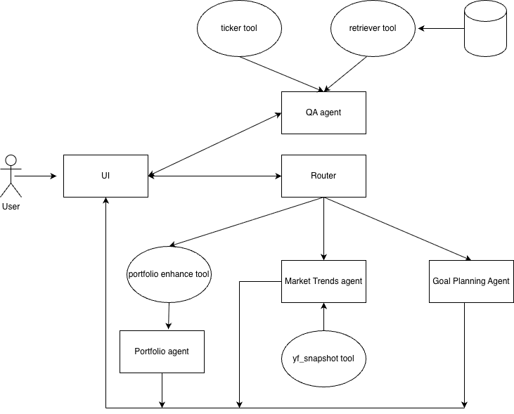

# Overview

Currently deployed on GCP:
[here](https://fin-ai-assistant-471184440470.us-central1.run.app/)

[Demo video](https://www.youtube.com/watch?v=CECdftp0F4A)

This project builds a practical, retrieval-augmented finance assistant that combines a large LLM with small focused tools to answer questions, analyze portfolios, surface market trends, and generate goal-driven recommendations.

Key components and roles:
- LLM: gemini-2.0-flash powers natural-language reasoning and response generation.
- UI: Streamlit front-end for quick interactive access.
- Retrieval: ChromaDB + retrieval_tool implements RAG to ground answers in documents.
- Market & portfolio tools: yfinance helpers (get_ticker_info, yf_snapshot) and portfolio_enhance compute valuations, allocations, historical snapshots, and enrich ticker data.
- Router/workflow: workflow.py directs UI context to the appropriate agent (QA, Market Trends, Portfolio Insights, Goal Planning).

Goal: provide accurate, actionable finance guidance by combining up-to-date market data, document retrieval for context, and LLM-driven synthesis while keeping modular tools and agents for clarity and extendability.

# Architecture




Components:

### LLM

The LLM used is gemini-2.0-flash. It was chosen because of its generious free tier offering.

### UI
- Streamlit-based interface

### Agents
- **QA Agent** — Answers finance-related questions.
- **Market Trends Agent** — Retrieves market trends for a given stock ticker.
- **Portfolio Insights Agent** — Evaluates a portfolio provided as JSON (tickers and amounts) and returns valuation and insights.
- **Goal Planning Agent** — Evaluates a user's financial details and goals, and provides recommendations.

### Tools
1. **retriever** — Retrieves documents from a ChromaDB vector store.
2. **Ticker** — Fetches basic stock data for a ticker.
3. **yf_snapshot** — Retrieves historical stock data and news from yfinance.
4. **Portfolio enhance** — Computes total portfolio value, allocation weights, and enriches tickers with related info.

# Setup instructions

create a .env file with your google api key:

GOOGLE_API_KEY=[your key]

```
$conda create -n fin-bot-submission python=3.11
$conda activate fin-bot-submission
$cd ai_finance_assistant
$pip install -r requirements.txt
$cd src/agents
$streamlit run app.py
```

# Agents, tools, and routing (API / integration notes)

### Agents (files and responsibilities)
- goal_planning.py  
    - Evaluates user financial details and goals; returns recommendations and plan-like outputs.
- market_trends.py  
    - Retrieves market trends and summary information for a given stock ticker.
- portfolio_insights.py  
    - Accepts a portfolio (JSON: tickers + amounts), returns valuation, allocation weights, and insights.
- qa_agent_test.py  
    - A standalone QA agent that uses RAG (retrieval-augmented generation) to answer finance questions from a ChromaDB vector store.


### Tools (files and functions)
- retrieval_tool.py  
    - Retrieval wrapper used by the QA agent to fetch contextual documents from ChromaDB.
- fin_tools.py  
    - get_ticker_info(ticker) — fetches basic stock info (yfinance).
    - yf_snapshot(...) — fetches historical prices and news snapshots (yfinance).
    - enhance_portfolio_data(portfolio_json) — computes total value, allocation weights, and enriches tickers (used by the portfolio enhancement tool).

### Router / Workflow
- workflow.py  
    - Routes requests to the appropriate agent based on UI state. Routing decision relies on a state variable called `context` that the UI provides.
- UI (Streamlit)  
    - Passes `context` from user interactions to workflow.py to determine which agent/tool to invoke.

### Design rationale & caveats
- ChromaDB chosen for vector store for speed of integration and ease of use.
- QA agent follows a RAG pattern: retrieval_tool -> context -> LLM answer.
- Separation rationale:
    - QA agent separated to simplify multi-turn/chat state handling.
    - portfolio_enhance kept as an independent tool because the portfolio agent returns structured JSON which proved unreliable when binding as a tool inside Langchain-style tool dispatch.
- Other agents are part of a mutil-agent graph.

### Quick references
- Multi-agent files: src/agents/{goal_planning.py, market_trends.py, portfolio_insights.py}
- QA agent file: src/agents/qa_agent_test.py
- Tools: src/tools/{retrieval_tool.py, fin_tools.py}
- Router: src/workflow.py

Use these references when instrumenting the UI, debugging routing, or extending agents/tools.

# Usage

create a .env file with your google api key:

GOOGLE_API_KEY=[your key]

```
$ cd src/agents
$ streamlit run app.py
````

# Troubleshooting guide